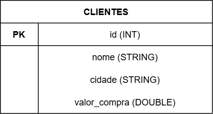

# Contextualização

## Sobre o Projeto

Este projeto foi desenvolvido para a disciplina de **Engenharia de Dados** do curso de Engenharia de Software (5ª fase), com o objetivo de explorar o uso do **Apache Spark** integrado ao **Delta Lake** e ao **Apache Iceberg** — dois dos principais formatos de tabela para arquitetura **Data Lakehouse**.

## Cenário

Utilizamos uma tabela de **clientes** de uma loja fictícia como fonte de dados, demonstrando operações de manipulação de dados com transações ACID em um ambiente distribuído:

- **INSERT:** inserção dos dados iniciais
- **UPDATE:** atualização de cidade e valor de compra de um cliente
- **DELETE:** remoção de um cliente da tabela
- **TIME TRAVEL / SNAPSHOTS:** consulta de versões anteriores dos dados

## Modelo ER



## Ambiente

O ambiente foi containerizado com **Docker**, utilizando a imagem oficial `jupyter/pyspark-notebook`, que já inclui Apache Spark e JupyterLab configurados. Isso garante reprodutibilidade — qualquer pessoa com Docker instalado consegue rodar o projeto.

```bash
docker compose up -d
```

Após subir o container, o JupyterLab fica disponível em `http://localhost:8888`.

## Tecnologias Utilizadas

| Tecnologia | Versão | Descrição |
|---|---|---|
| Apache Spark | 3.5.0 | Engine de processamento distribuído |
| Delta Lake | 3.2.0 | Formato de tabela com ACID para Data Lake |
| Apache Iceberg | 1.5.0 | Formato de tabela open source para Data Lake |
| PySpark | 3.5.0 | API Python para Apache Spark |
| JupyterLab | 4.5.7 | Ambiente interativo de notebooks |
| Docker | 29.4.1 | Containerização do ambiente |
| MkDocs Material | - | Documentação estática |

## Arquitetura

O projeto segue a arquitetura **Data Lakehouse**, que combina as vantagens do Data Warehouse (transações ACID, esquema definido) com as do Data Lake (armazenamento barato, flexibilidade de formatos).

Os formatos **Delta Lake** e **Apache Iceberg** são os principais projetos open source que viabilizam essa arquitetura, adicionando transações ACID a arquivos Parquet em um Data Lake.

## Estrutura do Projeto

```
spark-delta-iceberg/
├── notebooks/
│   ├── delta_lake.ipynb     # Notebook com demonstração do Delta Lake
│   └── iceberg.ipynb        # Notebook com demonstração do Apache Iceberg
├── docs/                    # Documentação MkDocs
├── data/                    # Dados gerados pelos notebooks
├── docker-compose.yml       # Configuração do ambiente Docker
├── mkdocs.yml               # Configuração da documentação
└── README.md                # Instruções de reprodução do ambiente
```

## Repositório

[github.com/isabelamadeirajose/spark-delta-iceberg](https://github.com/isabelamadeirajose/spark-delta-iceberg)